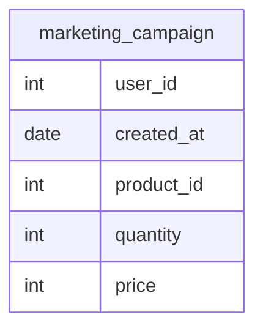

# Documentation for Table: dbo.marketing_campaign

## Overview
The `dbo.marketing_campaign` table is likely used to track marketing campaigns associated with specific users and products. Each record in the table represents a campaign event, detailing the user involved, the product being marketed, the quantity of the product, the price at which it is offered, and the date the campaign was created. This information can be utilized for analyzing the effectiveness of marketing strategies and understanding user engagement with different products.

## Columns

| Name         | Type   | Nullable | Default | Description                                   |
|--------------|--------|----------|---------|-----------------------------------------------|
| user_id      | int    | Yes      | NULL    | Identifier for the user associated with the campaign. |
| created_at   | date   | Yes      | NULL    | Date when the marketing campaign was created. |
| product_id   | int    | Yes      | NULL    | Identifier for the product being marketed.   |
| quantity     | int    | Yes      | NULL    | Quantity of the product involved in the campaign. |
| price        | int    | Yes      | NULL    | Price of the product during the campaign.    |

## Keys & Relationships
- **Primary Keys**: None defined.
- **Foreign Keys**: None defined.

## Indexes
No indexes are defined for the `dbo.marketing_campaign` table. Adding indexes on columns such as `user_id`, `product_id`, or `created_at` could improve query performance for searches and aggregations based on these fields.

## Sample Data

| user_id | created_at | product_id | quantity | price |
|---------|------------|-------------|----------|-------|
| 10      | 2019-01-01 | 101         | 3        | 55    |
| 10      | 2019-01-02 | 119         | 5        | 29    |
| 10      | 2019-03-31 | 111         | 2        | 149   |

## Data Volume
The `dbo.marketing_campaign` table contains approximately **102 rows**. This volume suggests that the table may be used for ongoing marketing campaigns, but it is relatively small, indicating that either the campaigns are limited in scope or that data retention policies may be in place.

## Data Quality Red Flags
- **Nullable Columns**: All columns in the table are nullable, which could lead to incomplete records if not managed properly.
- **Lack of Primary Key**: The absence of a primary key may result in duplicate records, making it difficult to uniquely identify each campaign entry.
- **No Foreign Keys**: Without foreign keys, there is no enforced relationship with other tables, which could lead to data integrity issues.
- **Default Values**: All columns have no default values, which may lead to missing data if not explicitly provided during inserts. 

Overall, while the table serves a clear purpose, the lack of constraints and nullable fields may pose challenges for data integrity and quality.