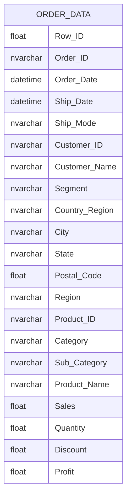

## Overview
The `dbo.order_data` table is designed to store detailed information about customer orders, including order specifics, shipping details, customer information, and product details. This table likely serves the purpose of tracking sales performance, customer behavior, and inventory management within a retail or e-commerce business context.

## Columns

| Name                     | Type       | Nullable | Default | Description                                      |
|--------------------------|------------|----------|---------|--------------------------------------------------|
| Row_ID                   | float      | Yes      | NULL    | Unique identifier for each row (likely for internal use). |
| Order_ID                 | nvarchar   | Yes      | NULL    | Unique identifier for each order.                |
| Order_Date               | datetime   | Yes      | NULL    | Date when the order was placed.                  |
| Ship_Date                | datetime   | Yes      | NULL    | Date when the order was shipped.                 |
| Ship_Mode                | nvarchar   | Yes      | NULL    | Method of shipping used for the order.           |
| Customer_ID              | nvarchar   | Yes      | NULL    | Unique identifier for the customer.              |
| Customer_Name            | nvarchar   | Yes      | NULL    | Name of the customer who placed the order.       |
| Segment                  | nvarchar   | Yes      | NULL    | Market segment to which the customer belongs.    |
| Country/Region           | nvarchar   | Yes      | NULL    | Country or region of the customer.               |
| City                     | nvarchar   | Yes      | NULL    | City of the customer.                             |
| State                    | nvarchar   | Yes      | NULL    | State of the customer.                            |
| Postal_Code              | float      | Yes      | NULL    | Postal code of the customer's address.           |
| Region                   | nvarchar   | Yes      | NULL    | Region of the customer's location.                |
| Product_ID               | nvarchar   | Yes      | NULL    | Unique identifier for the product sold.          |
| Category                 | nvarchar   | Yes      | NULL    | Category of the product.                          |
| Sub_Category             | nvarchar   | Yes      | NULL    | Sub-category of the product.                      |
| Product_Name             | nvarchar   | Yes      | NULL    | Name of the product sold.                         |
| Sales                    | float      | Yes      | NULL    | Total sales amount for the order.                |
| Quantity                 | float      | Yes      | NULL    | Quantity of products ordered.                     |
| Discount                 | float      | Yes      | NULL    | Discount applied to the order.                    |
| Profit                   | float      | Yes      | NULL    | Profit made from the order.                       |

## Keys & Relationships
- **Primary Keys**: None defined.
- **Foreign Keys**: None defined.

## Indexes
- **No indexes defined**: This may impact query performance, especially for searches on columns like `Order_ID`, `Customer_ID`, or `Product_ID`.

## Sample Data

| Row_ID | Order_ID          | Order_Date          | Ship_Date           | Ship_Mode       | Customer_ID | Customer_Name      | Segment   | Country/Region | City      | State   | Postal_Code | Region  | Product_ID         | Category      | Sub_Category | Product_Name                                                                 | Sales   | Quantity | Discount | Profit  |
|--------|-------------------|---------------------|---------------------|------------------|-------------|---------------------|-----------|----------------|-----------|---------|-------------|---------|---------------------|---------------|--------------|------------------------------------------------------------------------------|---------|----------|----------|---------|
| 8677.0 | CA-2021-163265    | 2021-02-16 00:00:00 | 2021-02-21 00:00:00 | Standard Class    | JS-16030    | Joy Smith           | Consumer  | United States  | Decatur   | Illinois | 62521.0     | Central | FUR-FU-10004270     | Furniture     | Furnishings  | Executive Impressions 13" Clairmont Wall Clock                             | 7.692   | 1.0      | 0.6      | -3.6537 |
| 8678.0 | CA-2021-141705    | 2021-10-24 00:00:00 | 2021-10-26 00:00:00 | First Class       | PO-18850    | Patrick O'Brill     | Consumer  | United States  | Mansfield | Texas   | 76063.0     | Central | FUR-TA-10004607     | Furniture     | Tables       | Hon 2111 Invitation Series Straight Table                                   | 517.405 | 5.0      | 0.3      | -81.3065|
| 8679.0 | CA-2020-112739    | 2020-09-02 00:00:00 | 2020-09-07 00:00:00 | Second Class      | RD-19810    | Ross DeVincentis    | Home Office| United States  | Houston   | Texas   | 77070.0     | Central | OFF-BI-10001132     | Office Supplies| Binders      | Acco PRESSTEX Data Binder with Storage Hooks, Dark Blue, 9 1/2" X 11"     | 8.608   | 8.0      | 0.8      | -13.3424|

## Data Volume
The `dbo.order_data` table contains approximately **9,994 rows**. This volume suggests that the table is likely used for reporting and analysis of sales data over a significant period, but may require optimization for performance if queries become complex or if the volume increases significantly.

## Data Quality Red Flags
- **Nullable Columns**: Many columns are nullable, which may lead to incomplete records if not managed properly.
- **Lack of Primary Key**: The absence of a primary key could lead to duplicate records and data integrity issues.
- **Potentially Inconsistent Data**: The use of float for `Postal_Code` and other identifiers may lead to precision issues or misinterpretation of data types.
- **Negative Profit Values**: The presence of negative profit values may indicate issues with pricing, discounts, or data entry errors that need to be investigated.