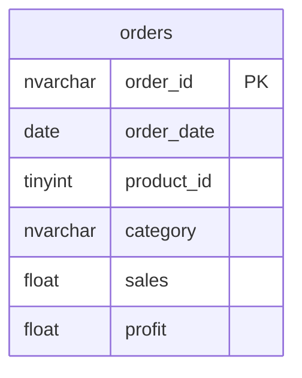

# Documentation for Table: dbo.orders

## Overview
The `dbo.orders` table is designed to store information about customer orders. Each record represents a unique order, capturing essential details such as the order ID, date, product information, sales amount, and profit. This table likely serves as a foundational component for analyzing sales performance, tracking profitability, and managing inventory across different product categories.

## Columns

| Name          | Type      | Nullable | Default | Description                           |
|---------------|-----------|----------|---------|---------------------------------------|
| order_id      | nvarchar  | No       | None    | Unique identifier for each order (PK)|
| order_date    | date      | No       | None    | Date when the order was placed       |
| product_id    | tinyint   | No       | None    | Identifier for the product ordered    |
| category      | nvarchar  | No       | None    | Category of the product               |
| sales         | float     | No       | None    | Total sales amount for the order      |
| profit        | float     | No       | None    | Profit made from the order            |

## Keys & Relationships
- **Primary Keys**: None defined in the schema.
- **Foreign Keys**: None defined in the schema.

## Indexes
No indexes are defined for the `dbo.orders` table. Adding indexes on columns such as `order_date`, `product_id`, or `category` could improve query performance for filtering and aggregating sales data.

## Sample Data

| order_id        | order_date | product_id | category        | sales         | profit |
|------------------|------------|-------------|------------------|---------------|--------|
| CA-2018-157147   | 2018-01-13 | 17          | Office Supplies   | 1325.85       | 239.0  |
| US-2018-140116   | 2018-03-10 | 17          | Office Supplies   | 636.41        | -16.0  |
| US-2018-148838   | 2018-03-17 | 10          | Furniture         | 1579.75       | -448.0 |

## Data Volume
The `dbo.orders` table contains approximately **222 rows**. This volume suggests that the table is relatively small, which may facilitate quick queries and analyses. However, as the business grows, monitoring the growth of this table will be essential to ensure performance remains optimal.

## Data Quality Red Flags
- **Primary Key Absence**: There is no primary key defined, which could lead to duplicate records and challenges in data integrity.
- **Nullable Columns**: All columns are marked as non-nullable, which is good for data integrity, but it may require strict validation during data entry to avoid errors.
- **Profit Values**: The presence of negative profit values in the sample data indicates potential issues with pricing, cost management, or data entry errors that should be investigated further.