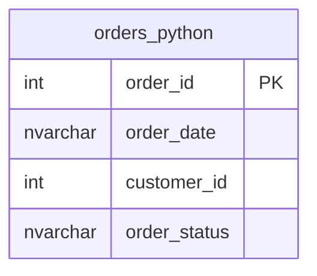

# Documentation for Table: dbo.orders_python

## Overview
The `dbo.orders_python` table is likely used to store information about customer orders in a business context. It appears to track various attributes of each order, including the order's unique identifier, the date it was placed, the customer associated with the order, and the current status of the order. This table may be part of a larger system for managing sales, inventory, or customer relationships.

## Columns

| Name            | Type      | Nullable | Default | Description                          |
|-----------------|-----------|----------|---------|--------------------------------------|
| order_id        | int       | Yes      | None    | Unique identifier for each order (PK) |
| order_date      | nvarchar  | Yes      | None    | Date when the order was placed      |
| customer_id     | int       | Yes      | None    | Identifier for the customer placing the order |
| order_status     | nvarchar  | Yes      | None    | Current status of the order         |

## Keys & Relationships
- **Primary Keys**: None defined.
- **Foreign Keys**: None defined.

## Indexes
No indexes are defined for the `dbo.orders_python` table. This may impact query performance, especially for searches or joins based on the `order_id`, `customer_id`, or `order_status` columns.

## Sample Data

| order_id | order_date | customer_id | order_status      |
|----------|------------|--------------|--------------------|
| 1        | 00:00.0    | 11599        | CLOSED             |
| 2        | 00:00.0    | 256          | PENDING_PAYMENT     |
| 3        | 00:00.0    | 12111        | COMPLETE           |

## Data Volume
The `dbo.orders_python` table contains approximately **68,883** rows. This volume suggests that the table is likely used in a production environment, potentially handling a significant number of customer orders.

## Data Quality Red Flags
- **Nullable Columns**: All columns are nullable, which may lead to incomplete records if not managed properly.
- **Order Date Format**: The `order_date` appears to contain a placeholder value ("00:00.0"), which is likely incorrect or indicates missing data.
- **Lack of Primary Key**: The absence of a primary key may lead to duplicate records or difficulties in uniquely identifying orders.
- **No Foreign Keys**: The lack of foreign key constraints may result in orphaned records or inconsistencies with customer data.

Overall, while the table serves a clear purpose, there are several data quality concerns that should be addressed to ensure the integrity and reliability of the data.