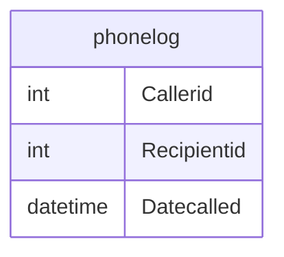

# Documentation for Table: dbo.phonelog

## Overview
The `dbo.phonelog` table is designed to store records of phone calls made within a system. Each record captures details about the caller, the recipient, and the date and time the call occurred. This table likely serves a telecommunications or customer service application where tracking call interactions is essential for analysis, reporting, and improving service quality.

## Columns

| Name         | Type      | Nullable | Default | Description                          |
|--------------|-----------|----------|---------|--------------------------------------|
| Callerid     | int       | Yes      | None    | Identifier for the caller.           |
| Recipientid  | int       | Yes      | None    | Identifier for the recipient.        |
| Datecalled    | datetime  | Yes      | None    | Date and time when the call was made.|

## Keys & Relationships
- **Primary Keys**: None defined.
- **Foreign Keys**: None defined.

## Indexes
No indexes are defined for the `phonelog` table. Adding indexes on `Callerid`, `Recipientid`, or `Datecalled` could improve query performance for searches and reports based on these columns.

## Sample Data

| Callerid | Recipientid | Datecalled           |
|----------|-------------|----------------------|
| 1        | 2           | 2019-01-01 09:00:00  |
| 1        | 3           | 2019-01-01 17:00:00  |
| 1        | 4           | 2019-01-01 23:00:00  |

## Data Volume
The `phonelog` table contains approximately **14 rows**. This volume suggests that the table may be used for a limited scope of call records, possibly for a specific time period or a limited set of users. As the volume grows, performance considerations may arise, particularly if queries are run frequently against this table.

## Data Quality Red Flags
- **Nullable Columns**: All columns in the `phonelog` table are nullable, which could lead to incomplete records if not properly managed.
- **Lack of Primary Key**: The absence of a primary key may result in duplicate records, making it difficult to ensure data integrity.
- **No Foreign Keys**: Without foreign keys, there is no enforced relationship with other tables, which could lead to orphaned records or inconsistencies in the data.

Overall, while the `phonelog` table serves a clear purpose, attention should be given to its design to ensure data quality and integrity as usage scales.