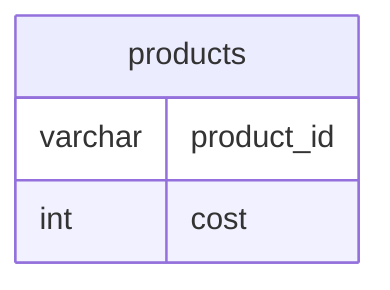

# Documentation for Table: dbo.products

## Overview
The `dbo.products` table is designed to store information about products in a business context. It likely serves as a catalog for items that a company sells, with each product identified by a unique `product_id`. The `cost` column indicates the price of each product, which is essential for sales and inventory management. The absence of primary keys suggests that the table may not enforce unique product identification, which could lead to data integrity issues.

## Columns

| Name         | Type    | Nullable | Default | Description                          |
|--------------|---------|----------|---------|--------------------------------------|
| product_id   | varchar | Yes      | None    | Unique identifier for each product. |
| cost         | int     | Yes      | None    | Cost of the product in currency.    |

## Keys & Relationships
- **Primary Keys**: None defined.
- **Foreign Keys**: None defined.

## Indexes
No indexes are defined for the `dbo.products` table. This may lead to performance issues when querying the table, especially as the volume of data increases. Adding an index on `product_id` could improve lookup times for specific products.

## Sample Data

| product_id | cost |
|------------|------|
| P1         | 200  |
| P2         | 300  |
| P3         | 500  |

## Data Volume
The `dbo.products` table currently contains approximately 4 rows. This low volume suggests that the table is either new or not heavily utilized. However, as the business grows, the volume may increase, necessitating performance optimizations such as indexing.

## Data Quality Red Flags
- **Primary Key Absence**: The lack of a primary key could lead to duplicate entries for products, which may compromise data integrity.
- **Nullable Columns**: Both columns are nullable, which may result in incomplete records if not managed properly.
- **Data Type Considerations**: The `product_id` is a `varchar`, which may not be ideal for a unique identifier; using a more structured type (like an integer or GUID) could enhance data integrity.

Overall, while the `dbo.products` table serves a fundamental role in product management, it requires careful consideration regarding data integrity and performance as the business scales.