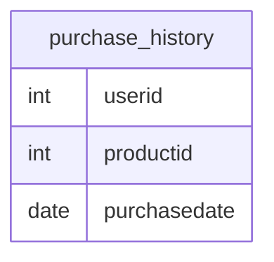

# Documentation for Table: dbo.purchase_history

## Overview
The `purchase_history` table is designed to track the purchase transactions made by users. Each record in this table likely represents a unique purchase event, capturing essential details such as the user who made the purchase, the product purchased, and the date of the transaction. This table serves a critical role in understanding customer behavior, sales trends, and inventory management.

## Columns

| Name          | Type   | Nullable | Default | Description                          |
|---------------|--------|----------|---------|--------------------------------------|
| userid        | int    | Yes      | NULL    | Identifier for the user making the purchase. |
| productid     | int    | Yes      | NULL    | Identifier for the product being purchased. |
| purchasedate  | date   | Yes      | NULL    | The date when the purchase was made. |

## Keys & Relationships
- **Primary Keys**: None defined.
- **Foreign Keys**: None defined.

## Indexes
- **No indexes defined**: This may lead to performance issues when querying the table for specific users or products, especially as the data volume grows.

## Sample Data

| userid | productid | purchasedate |
|--------|-----------|---------------|
| 1      | 1         | 2012-01-23    |
| 1      | 2         | 2012-01-23    |
| 1      | 3         | 2012-01-25    |

## Data Volume
The `purchase_history` table currently contains approximately **11 rows**. This volume is relatively small, which may not pose immediate performance concerns. However, as the business scales and more transactions are recorded, it will be essential to consider indexing strategies and potential partitioning to maintain query performance.

## Data Quality Red Flags
- **Nullable Columns**: All columns in the table are nullable, which may lead to incomplete records if not managed properly. It is advisable to enforce constraints to ensure that critical information is captured.
- **No Primary Key**: The absence of a primary key may lead to duplicate records, making it difficult to uniquely identify each purchase transaction.
- **No Foreign Keys**: Without foreign key constraints, there is no enforcement of referential integrity with related tables (e.g., users and products), which could lead to orphaned records or invalid references.

Overall, while the `purchase_history` table serves a clear purpose, there are several areas for improvement in terms of data integrity and performance optimization.