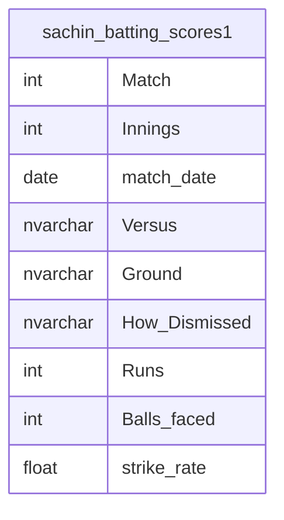

# Documentation for Table: `dbo.sachin_batting_scores1`

## Overview
The `sachin_batting_scores1` table is designed to store detailed statistics of batting performances by Sachin Tendulkar in various cricket matches. The inferred business purpose of this table is to provide a historical record of individual match performances, which can be used for analysis, reporting, and performance tracking of the player over time.

## Columns

| Name               | Type        | Nullable | Default | Description                                   |
|--------------------|-------------|----------|---------|-----------------------------------------------|
| Match              | int         | Yes      | NULL    | The match number in which the performance occurred. |
| Innings            | int         | Yes      | NULL    | The innings number within the match.         |
| match_date         | date        | Yes      | NULL    | The date when the match was played.          |
| Versus             | nvarchar(MAX)| Yes     | NULL    | The opposing team in the match.               |
| Ground             | nvarchar(MAX)| Yes     | NULL    | The venue where the match took place.        |
| How_Dismissed      | nvarchar(MAX)| Yes     | NULL    | Description of how the player was dismissed. |
| Runs               | int         | Yes      | NULL    | The number of runs scored by the player.     |
| Balls_faced        | int         | Yes      | NULL    | The number of balls faced by the player.     |
| strike_rate        | float       | Yes      | NULL    | The strike rate of the player in the innings. |

## Keys & Relationships
- **Primary Keys**: None defined.
- **Foreign Keys**: None defined.

## Indexes
- **No indexes defined**: This may affect query performance, especially for searches and aggregations on columns like `match_date`, `Versus`, or `Runs`.

## Sample Data

| Match | Innings | match_date | Versus       | Ground                          | How_Dismissed                       | Runs | Balls_faced | strike_rate |
|-------|---------|------------|--------------|---------------------------------|-------------------------------------|------|-------------|-------------|
| 1     | 1       | 1989-12-18 | Pakistan     | Jinnah Stadium (Gujwranwala)   | c Wasim Akram b Waqar Younis      | 0    | 2           | 0.0         |
| 2     | 2       | 1990-03-01 | New Zealand  | Carisbrook                      | c & b S A Thomson                   | 0    | 2           | 0.0         |
| 3     | 3       | 1990-03-06 | New Zealand  | Basin Reserve                   | c ∩ I D S Smith b S A Thomson      | 36   | 39          | 92.31       |

## Data Volume
The table contains approximately **463 rows**. This volume suggests a substantial dataset for analyzing the batting performance over a significant period, allowing for various statistical analyses and insights into the player's career.

## Data Quality Red Flags
- **Nullable Columns**: All columns are nullable, which may lead to incomplete records if not managed properly.
- **No Primary Key**: The absence of a primary key could lead to duplicate records or difficulty in uniquely identifying each performance entry.
- **Inconsistent Data**: The `How_Dismissed` column contains varied formats, which may complicate analysis if not standardized.
- **Potentially Sparse Data**: Given that many columns are nullable, there may be instances of missing data that could affect the integrity of analyses.