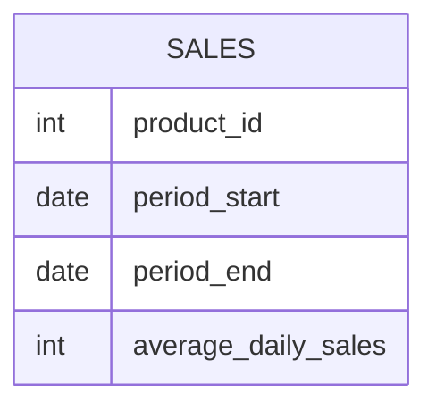

# Documentation for Table: dbo.sales

## Overview
The `dbo.sales` table is designed to capture sales data for various products over specific time periods. It likely serves the purpose of analyzing sales performance by tracking average daily sales figures for each product within defined date ranges. This information can be crucial for inventory management, sales forecasting, and performance evaluation.

## Columns

| Name                     | Type  | Nullable | Default | Description                                   |
|--------------------------|-------|----------|---------|-----------------------------------------------|
| product_id               | int   | Yes      | None    | Identifier for the product being sold.       |
| period_start             | date  | Yes      | None    | Start date of the sales period.              |
| period_end               | date  | Yes      | None    | End date of the sales period.                |
| average_daily_sales      | int   | Yes      | None    | Average number of sales per day during period.|

## Keys & Relationships
- **Primary Keys**: None defined.
- **Foreign Keys**: None defined.

## Indexes
- **No indexes defined**: This may affect query performance, especially for filtering or aggregating data based on `product_id`, `period_start`, or `period_end`.

## Sample Data

| product_id | period_start | period_end | average_daily_sales |
|------------|--------------|-------------|---------------------|
| 1          | 2019-01-25   | 2019-02-28  | 100                 |
| 2          | 2018-12-01   | 2020-01-01  | 10                  |
| 3          | 2019-12-01   | 2020-01-31  | 1                   |

## Data Volume
The `dbo.sales` table currently contains **3 rows**. This low volume may limit the effectiveness of trend analysis and forecasting. As the dataset grows, it will be important to consider indexing strategies to maintain query performance.

## Data Quality Red Flags
- **Nullable Columns**: All columns are nullable, which may lead to incomplete records if not managed properly.
- **No Primary Key**: The absence of a primary key could result in duplicate records, making data integrity a concern.
- **Lack of Foreign Keys**: Without foreign keys, there is no enforced relationship with other tables, which may lead to orphaned records or inconsistencies in product data.
- **Sample Data Variability**: The average daily sales figures vary significantly, which may indicate inconsistent sales performance or data entry issues.