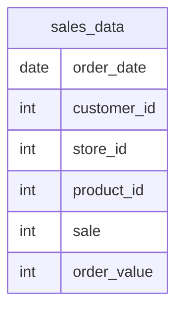

# Documentation for `dbo.sales_data` Table

## Overview
The `dbo.sales_data` table is designed to store sales transaction records for a retail business. It captures essential details about each sale, including the date of the transaction, customer information, store location, product details, the quantity sold, and the total order value. This data is likely used for sales analysis, inventory management, and customer relationship management.

## Columns

| Name          | Type   | Nullable | Default | Description                          |
|---------------|--------|----------|---------|--------------------------------------|
| order_date    | date   | Yes      | NULL    | The date when the sale occurred.     |
| customer_id   | int    | Yes      | NULL    | Identifier for the customer making the purchase. |
| store_id      | int    | Yes      | NULL    | Identifier for the store where the sale took place. |
| product_id    | int    | Yes      | NULL    | Identifier for the product sold.     |
| sale          | int    | Yes      | NULL    | Quantity of the product sold in the transaction. |
| order_value   | int    | Yes      | NULL    | Total monetary value of the order.   |

## Keys & Relationships
- **Primary Keys**: None defined.
- **Foreign Keys**: None defined.

## Indexes
No indexes are defined for the `sales_data` table. Adding indexes on columns such as `order_date`, `customer_id`, or `product_id` could improve query performance for sales reporting and analysis.

## Sample Data

| order_date | customer_id | store_id | product_id | sale | order_value |
|------------|-------------|----------|------------|------|-------------|
| 2024-12-01 | 109         | 1        | 3          | 2    | 700         |
| 2024-12-02 | 110         | 2        | 2          | 1    | 300         |
| 2024-12-03 | 111         | 1        | 5          | 3    | 900         |

## Data Volume
The `sales_data` table currently contains approximately **15 rows**. This volume suggests that the table may be in the early stages of data collection or that it is used for a specific reporting period. As the business grows, the volume of data is likely to increase, necessitating considerations for performance and storage.

## Data Quality Red Flags
- **Nullable Columns**: All columns in the `sales_data` table are nullable, which may lead to incomplete records if not managed properly.
- **Lack of Primary Key**: The absence of a primary key could lead to duplicate records and challenges in data integrity.
- **No Foreign Keys**: Without foreign keys, there is no enforced relationship with other tables, which may lead to orphaned records or inconsistencies in customer, store, or product data.

Overall, while the `sales_data` table serves a clear purpose, it would benefit from the implementation of primary keys and foreign keys to enhance data integrity and quality.