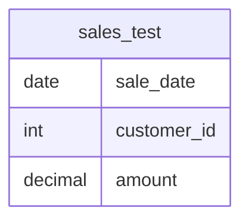

# Documentation for Table: dbo.sales_test

## Overview
The `dbo.sales_test` table is designed to store sales transaction data. It likely serves the purpose of tracking sales activities, including the date of the sale, the customer involved, and the monetary amount of each transaction. This table can be used for reporting and analysis of sales performance over time, customer purchasing behavior, and revenue generation.

## Columns

| Name         | Type      | Nullable | Default | Description                          |
|--------------|-----------|----------|---------|--------------------------------------|
| sale_date    | date      | Yes      | None    | The date when the sale occurred.     |
| customer_id  | int       | Yes      | None    | The unique identifier for the customer. |
| amount       | decimal   | Yes      | None    | The monetary amount of the sale.     |

## Keys & Relationships
- **Primary Keys**: None defined.
- **Foreign Keys**: None defined.

## Indexes
No indexes are defined for the `sales_test` table. This may impact query performance, especially for searches or aggregations based on `sale_date`, `customer_id`, or `amount`.

## Sample Data

| sale_date  | customer_id | amount  |
|------------|-------------|---------|
| 2026-01-01 | 101         | 500.00  |
| 2026-01-01 | 102         | 300.00  |
| 2026-01-02 | 101         | 700.00  |

## Data Volume
The `sales_test` table currently contains approximately **11 rows**. This volume is relatively small, which may be suitable for testing purposes but may not provide sufficient data for comprehensive analysis or reporting.

## Data Quality Red Flags
- **Nullable Columns**: All columns are nullable, which may lead to incomplete records if not properly managed.
- **Lack of Primary Key**: The absence of a primary key could result in duplicate records and challenges in maintaining data integrity.
- **No Foreign Keys**: Without foreign key constraints, there is no enforcement of relationships with other tables, which may lead to orphaned records or inconsistent data.

Overall, while the `sales_test` table serves a clear purpose, there are several areas for improvement in terms of data integrity and quality management.