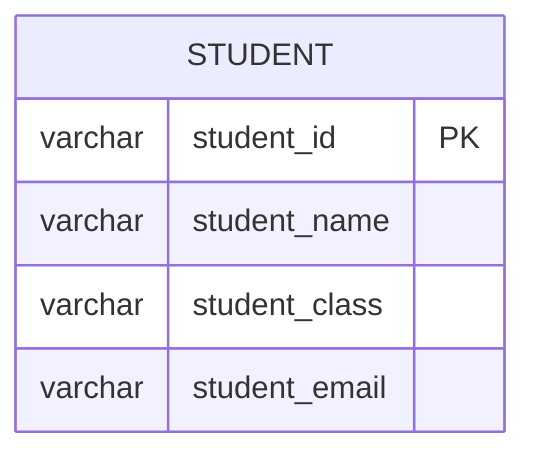

# Documentation for Table: dbo.schooldatabase

## Overview
The `dbo.schooldatabase` table is designed to store information about students in a school. It captures essential details such as student identification, name, class, and email address. This table likely serves as a foundational component for managing student records, facilitating communication, and tracking academic progress within the educational institution.

## Columns

| Name            | Type    | Nullable | Default | Description                       |
|-----------------|---------|----------|---------|-----------------------------------|
| student_id      | varchar | No       | None    | Unique identifier for each student (PK) |
| student_name    | varchar | No       | None    | Full name of the student          |
| student_class   | varchar | No       | None    | Class or grade level of the student |
| student_email   | varchar | No       | None    | Email address of the student      |

## Keys & Relationships
- **Primary Keys**: None defined.
- **Foreign Keys**: None defined.

## Indexes
- **No indexes defined**: This may affect query performance, especially for lookups by student_id or student_email.

## Sample Data

| student_id | student_name | student_class | student_email              |
|------------|--------------|---------------|-----------------------------|
| 1700       | ramesh       | VII           | kumar157@gmail.com          |
| 1701       | suresh       | X             | Suresh.052@gmail.com        |
| 1702       | chandra      | VI            | chandra007gmail.com         |

## Data Volume
The `dbo.schooldatabase` table currently contains approximately **7 rows**. This volume is relatively small, which may imply that the database is either new or not fully populated. As the number of records grows, considerations for indexing and performance optimization will become increasingly important.

## Data Quality Red Flags
- **Primary Key Absence**: The table lacks a defined primary key, which can lead to issues with data integrity and duplicate records.
- **Email Format**: The email address for student_id `1702` appears to be incorrectly formatted (missing '@'), which could lead to communication issues.
- **No Foreign Keys**: The absence of foreign keys suggests that there may be no relationships defined with other tables, which could limit the ability to enforce referential integrity.

Overall, while the table serves a clear purpose, improvements in data structure and quality checks are recommended to enhance its reliability and usability.