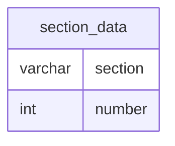

# Documentation for Table: dbo.section_data

## Overview
The `dbo.section_data` table appears to store information related to sections, likely in an educational or organizational context. Each entry consists of a section identifier and a corresponding number, which may represent a count, identifier, or some other metric associated with that section. The table's structure suggests it is used for tracking or categorizing data by sections.

## Columns

| Name      | Type    | Nullable | Default | Description                          |
|-----------|---------|----------|---------|--------------------------------------|
| section   | varchar | Yes      | None    | Identifier for the section (max 5 chars) |
| number    | int     | Yes      | None    | Associated number for the section (max 4 digits) |

## Keys & Relationships
- **Primary Keys**: None defined.
- **Foreign Keys**: None defined.

## Indexes
- **No indexes defined**: This may lead to slower query performance when filtering or searching by `section` or `number`. Consider adding indexes if these columns are frequently queried.

## Sample Data

| section | number |
|---------|--------|
| A       | 5      |
| A       | 7      |
| A       | 10     |

## Data Volume
The `dbo.section_data` table contains approximately **12 rows**. This volume is relatively small, which may imply that performance is not a significant concern at this time. However, as data grows, indexing strategies should be considered to maintain query efficiency.

## Data Quality Red Flags
- **Nullable Columns**: Both columns are nullable, which may lead to incomplete records if not managed properly.
- **Lack of Primary Key**: The absence of a primary key could result in duplicate entries, making data integrity a concern.
- **No Foreign Keys**: Without foreign keys, there is no enforced relationship with other tables, which may lead to orphaned records or inconsistencies in related data.

Overall, while the table serves a clear purpose, attention should be given to its structure and constraints to ensure data integrity and quality.