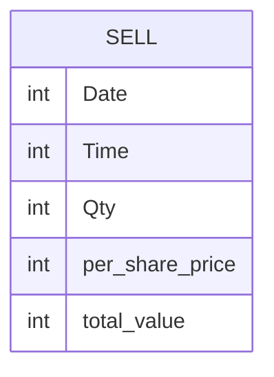

# Documentation for Table: dbo.sell

## Overview
The `dbo.sell` table appears to be designed to track sales transactions. Each record likely represents a sale of a financial asset or product, capturing essential details such as the date and time of the transaction, the quantity sold, the price per share, and the total value of the sale. This table is crucial for analyzing sales performance and revenue generation over time.

## Columns

| Name              | Type | Nullable | Default | Description                          |
|-------------------|------|----------|---------|--------------------------------------|
| Date              | int  | Yes      | NULL    | The date of the sale (likely in a numeric format) |
| Time              | int  | Yes      | NULL    | The time of the sale (likely in a numeric format) |
| Qty               | int  | Yes      | NULL    | The quantity of items sold           |
| per_share_price   | int  | Yes      | NULL    | The price per share/item sold        |
| total_value       | int  | Yes      | NULL    | The total value of the sale          |

## Keys & Relationships
- **Primary Keys**: None defined.
- **Foreign Keys**: None defined.

## Indexes
- **No indexes defined**: This may impact query performance, especially for searches or aggregations on the columns.

## Sample Data

| Date | Time | Qty | per_share_price | total_value |
|------|------|-----|------------------|-------------|
| 15   | 15   | 15  | 20               | 300         |

## Data Volume
The `dbo.sell` table currently contains **1 row**. This low volume may limit the ability to perform meaningful analysis or trend identification. As the table grows, it will be important to consider indexing strategies to optimize query performance.

## Data Quality Red Flags
- **Nullable Columns**: All columns are nullable, which may lead to incomplete records if not properly managed.
- **Lack of Primary Key**: The absence of a primary key could lead to duplicate records and challenges in data integrity.
- **Numeric Date and Time**: The use of integers for date and time may lead to confusion or errors in interpretation; it is unclear how these values are formatted or represented.
- **No Default Values**: The absence of default values may result in missing data if not handled correctly during data entry.