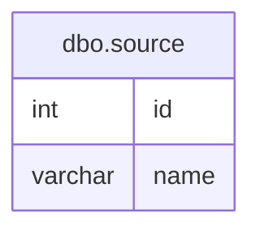

# Documentation for Table: dbo.source

## Overview
The `dbo.source` table appears to be designed to store information about various sources, likely for a business context where different entities or origins are tracked. The table contains identifiers and names for these sources, which could be used in reporting, analytics, or operational processes. The lack of primary keys suggests that the table may not enforce uniqueness, which could lead to potential data integrity issues.

## Columns

| Name       | Type      | Nullable | Default | Description                     |
|------------|-----------|----------|---------|---------------------------------|
| id         | int       | Yes      | NULL    | Identifier for the source.      |
| name       | varchar(5)| Yes      | NULL    | Name of the source (max 5 chars). |

## Keys & Relationships
- **Primary Keys**: None defined.
- **Foreign Keys**: None defined.

## Indexes
- **No indexes defined**: This may lead to performance issues for queries that filter or sort based on the `id` or `name` columns.

## Sample Data

| id | name |
|----|------|
| 1  | A    |
| 2  | B    |
| 3  | C    |

## Data Volume
The `dbo.source` table contains approximately **4 rows**. This low volume suggests that the table may be in the early stages of data collection or that it is intended for a limited set of sources. As the volume increases, considerations for indexing and data integrity will become more critical.

## Data Quality Red Flags
- **Nullable Columns**: Both columns are nullable, which may lead to incomplete records if not managed properly.
- **No Primary Key**: The absence of a primary key raises concerns about data integrity and the potential for duplicate entries.
- **Short Name Length**: The `name` column has a maximum length of 5 characters, which may limit the descriptive capability of the source names. This could lead to ambiguity if multiple sources have similar short names.