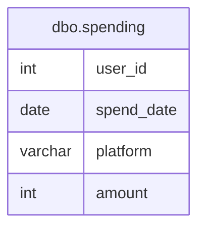

# Documentation for Table: dbo.spending

## Overview
The `dbo.spending` table is designed to track user spending activities across different platforms. Each record represents a spending event, capturing details such as the user ID, the date of the spending, the platform used for the transaction, and the amount spent. This table likely serves the purpose of analyzing user spending behavior, enabling businesses to understand trends and make informed decisions regarding marketing and product offerings.

## Columns

| Name         | Type      | Nullable | Default | Description                          |
|--------------|-----------|----------|---------|--------------------------------------|
| user_id     | int       | Yes      | NULL    | Identifier for the user making the spending. |
| spend_date   | date      | Yes      | NULL    | The date when the spending occurred. |
| platform     | varchar   | Yes      | NULL    | The platform used for the spending (e.g., mobile, desktop). |
| amount       | int       | Yes      | NULL    | The amount of money spent.          |

## Keys & Relationships
- **Primary Keys**: None defined.
- **Foreign Keys**: None defined.

## Indexes
- **No indexes defined**: This may impact query performance, especially for searches or aggregations on columns like `user_id`, `spend_date`, or `platform`.

## Sample Data

| user_id | spend_date | platform | amount |
|---------|------------|----------|--------|
| 1       | 2019-07-01 | mobile   | 100    |
| 1       | 2019-07-01 | desktop  | 100    |
| 2       | 2019-07-01 | mobile   | 100    |

## Data Volume
The `dbo.spending` table currently contains approximately **6 rows**. This volume is relatively small, which may limit the insights that can be derived from the data. As the dataset grows, performance considerations and data management strategies will need to be addressed.

## Data Quality Red Flags
- **Nullable Columns**: All columns are nullable, which raises concerns about data completeness. If key fields like `user_id`, `spend_date`, or `amount` are often null, it could hinder analysis.
- **No Primary Key**: The absence of a primary key may lead to duplicate records, making it difficult to ensure data integrity.
- **Lack of Indexes**: Without indexes, query performance may degrade as the dataset grows, particularly for searches on `user_id` or `spend_date`.