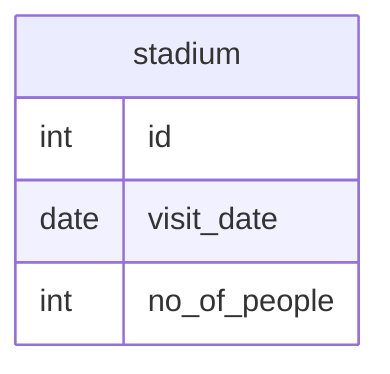

# Documentation for Table: dbo.stadium

## Overview
The `dbo.stadium` table appears to be designed to track visits to a stadium, capturing the date of the visit and the number of people present. This information could be useful for analyzing attendance trends, planning events, or managing stadium resources. The absence of primary keys and foreign keys suggests that this table may be used for logging purposes rather than as a relational entity.

## Columns

| Name            | Type   | Nullable | Default | Description                       |
|-----------------|--------|----------|---------|-----------------------------------|
| id              | int    | Yes      | NULL    | Unique identifier for each record |
| visit_date      | date   | Yes      | NULL    | Date of the visit                 |
| no_of_people    | int    | Yes      | NULL    | Number of people present          |

## Keys & Relationships
- **Primary Keys**: None defined.
- **Foreign Keys**: None defined.

## Indexes
No indexes are defined for this table. As a result, queries may not be optimized for performance, especially when filtering or sorting by `visit_date` or `no_of_people`.

## Sample Data

| id | visit_date | no_of_people |
|----|------------|--------------|
| 1  | 2017-07-01 | 10           |
| 2  | 2017-07-02 | 109          |
| 3  | 2017-07-03 | 150          |

## Data Volume
The table currently contains approximately **8 rows**. This volume is relatively small, which may not pose significant performance issues. However, as the data grows, the lack of indexing could lead to slower query performance.

## Data Quality Red Flags
- The `id` column is nullable, which is unusual for an identifier and could lead to data integrity issues.
- There are no primary keys defined, which may result in duplicate records.
- All columns are nullable, which raises concerns about data completeness and consistency.
- The absence of foreign keys suggests that this table may not be linked to other relevant data, limiting its usefulness in a broader context.