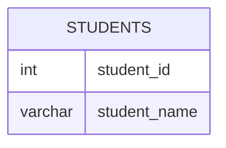

# Documentation for Table: dbo.students

## Overview
The `dbo.students` table is designed to store information about students within an educational context. It likely serves as a foundational table for managing student records, which may be used in conjunction with other tables related to courses, enrollments, or academic performance. The absence of primary keys suggests that the table may not be fully normalized or that it is in a preliminary state of design.

## Columns

| Name          | Type         | Nullable | Default | Description                       |
|---------------|--------------|----------|---------|-----------------------------------|
| student_id    | int          | Yes      | None    | Unique identifier for each student (PK) |
| student_name  | varchar(20)  | Yes      | None    | Name of the student               |

## Keys & Relationships
- **Primary Keys**: None defined.
- **Foreign Keys**: None defined.

## Indexes
No indexes are defined for the `dbo.students` table. This may impact query performance, especially as the volume of data grows. It is advisable to consider adding indexes on frequently queried columns, such as `student_id` or `student_name`.

## Sample Data

| student_id | student_name |
|-------------|---------------|
| 1           | Daniel        |
| 2           | Jade          |
| 3           | Stella        |

## Data Volume
The `dbo.students` table currently contains approximately 5 rows. This volume is relatively small, which may not pose significant performance issues. However, as the number of records increases, careful consideration should be given to indexing and normalization to maintain query performance and data integrity.

## Data Quality Red Flags
- **Nullable Columns**: Both columns (`student_id` and `student_name`) are nullable, which may lead to incomplete records if not managed properly.
- **Lack of Primary Key**: The absence of a primary key raises concerns about data integrity and the ability to uniquely identify records.
- **Potential for Duplicate Records**: Without a primary key or unique constraint, there is a risk of duplicate entries for students, which could complicate data management and reporting.

Overall, the `dbo.students` table requires further design considerations to ensure data integrity and optimal performance as it scales.