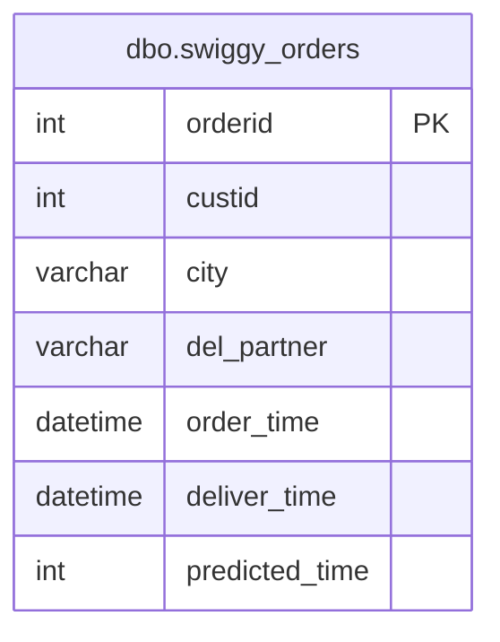

# Documentation for Table: dbo.swiggy_orders

## Overview
The `dbo.swiggy_orders` table is designed to store information about customer orders placed through the Swiggy platform. It captures essential details such as the order ID, customer ID, city of delivery, delivery partner, order and delivery times, and the predicted delivery time. This table is crucial for managing and analyzing order fulfillment, delivery efficiency, and customer service metrics.

## Columns

| Name               | Type        | Nullable | Default | Description                                   |
|--------------------|-------------|----------|---------|-----------------------------------------------|
| orderid (PK)      | int         | false    | null    | Unique identifier for each order.            |
| custid             | int         | true     | null    | Identifier for the customer placing the order. |
| city               | varchar(50) | true     | null    | City where the order is to be delivered.     |
| del_partner        | varchar(50) | true     | null    | Name of the delivery partner handling the order. |
| order_time         | datetime    | true     | null    | Timestamp when the order was placed.         |
| deliver_time       | datetime    | true     | null    | Timestamp when the order was delivered.      |
| predicted_time     | int         | true     | null    | Estimated time (in minutes) for delivery.    |

## Keys & Relationships
- **Primary Key**: 
  - `orderid`
  
- **Foreign Keys**: 
  - None defined.

## Indexes
- **PK__swiggy_o__080E37750616283F**: 
  - **Columns**: `orderid`
  - **Type**: Clustered
  - **Usage**: This index ensures that each order ID is unique and supports efficient retrieval of orders by their ID.

## Sample Data

| orderid | custid | city   | del_partner | order_time          | deliver_time        | predicted_time |
|---------|--------|--------|-------------|----------------------|----------------------|-----------------|
| 1       | 101    | Mumbai | Partner A   | 2024-12-18 10:00:00  | 2024-12-18 11:30:00  | 60              |
| 2       | 102    | Delhi  | Partner A   | 2024-12-18 09:00:00  | 2024-12-18 10:00:00  | 45              |
| 3       | 103    | Pune   | Partner A   | 2024-12-18 15:00:00  | 2024-12-18 15:30:00  | 30              |

## Data Volume
The `dbo.swiggy_orders` table currently contains approximately **12 rows**. This volume suggests that the table may be in the early stages of data accumulation or may represent a specific time frame of orders. As the business grows, monitoring the volume will be essential for performance and storage considerations.

## Data Quality Red Flags
- **Nullable Columns**: Several columns, including `custid`, `city`, `del_partner`, `order_time`, `deliver_time`, and `predicted_time`, are nullable, which may lead to incomplete records if not managed properly.
- **Missing Foreign Keys**: There are no foreign keys defined, which could lead to orphaned records if customer data is stored in a separate table.
- **Inconsistent Data**: The `predicted_time` column is an integer, but its relationship to the order and delivery times is not explicitly defined, which could lead to confusion in data interpretation.