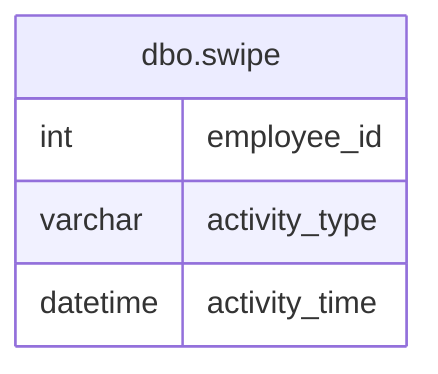

# Documentation for Table: dbo.swipe

## Overview
The `dbo.swipe` table is designed to track employee activities related to system access, specifically logins and logouts. This table likely serves the purpose of monitoring employee attendance and system usage, providing insights into employee behavior and operational efficiency. The data captured can be used for auditing, security, and performance analysis.

## Columns

| Name             | Type       | Nullable | Default | Description                          |
|------------------|------------|----------|---------|--------------------------------------|
| employee_id      | int        | Yes      | None    | Identifier for the employee.        |
| activity_type    | varchar(10)| Yes      | None    | Type of activity (e.g., login/logout). |
| activity_time    | datetime   | Yes      | None    | Timestamp of the activity.          |

## Keys & Relationships
- **Primary Keys**: None defined.
- **Foreign Keys**: None defined.

## Indexes
No indexes are defined for the `dbo.swipe` table. This may impact query performance, especially for searches based on `employee_id` or `activity_time`.

## Sample Data

| employee_id | activity_type | activity_time        |
|-------------|----------------|-----------------------|
| 1           | login          | 2024-07-23 08:00:00   |
| 1           | logout         | 2024-07-23 12:00:00   |
| 1           | login          | 2024-07-23 13:00:00   |

## Data Volume
The `dbo.swipe` table contains approximately **12 rows**. This volume suggests that the table may be used for a limited time frame or for a small number of employees. As the organization grows, the volume of data may increase, necessitating performance considerations and potential indexing strategies.

## Data Quality Red Flags
- **Nullable Columns**: All columns are nullable, which may lead to incomplete records if not properly managed.
- **Lack of Primary Key**: The absence of a primary key could result in duplicate entries for the same employee and activity, leading to data integrity issues.
- **No Foreign Keys**: Without foreign key constraints, there is no enforcement of relationships with other tables, which could lead to orphaned records or inconsistencies in employee data.

Overall, while the `dbo.swipe` table serves a clear purpose, attention should be given to data integrity and quality to ensure reliable reporting and analysis.