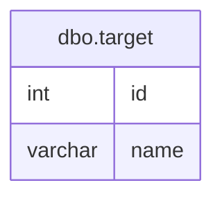

## Overview
The `dbo.target` table appears to be designed to store information about various targets, likely for a business process that involves categorizing or identifying specific entities. The table includes an identifier and a name for each target, which suggests it may be used in contexts such as marketing, sales, or project management where targets need to be tracked or referenced.

## Columns

| Name      | Type    | Nullable | Default | Description                       |
|-----------|---------|----------|---------|-----------------------------------|
| id        | int     | Yes      | None    | Unique identifier for the target. |
| name      | varchar | Yes      | None    | Name of the target (max 5 chars).|

## Keys & Relationships
- **Primary Keys**: None defined.
- **Foreign Keys**: None defined.

## Indexes
No indexes are defined for the `dbo.target` table. This may impact query performance, especially for lookups or joins, as there are no optimizations in place for searching or filtering based on the columns.

## Sample Data

| id | name |
|----|------|
| 1  | A    |
| 2  | B    |
| 4  | X    |

## Data Volume
The `dbo.target` table contains approximately 4 rows. This low volume suggests that the table may be in the early stages of data population or that it is intended for a limited set of targets. The small size may not pose significant performance issues, but it could limit the effectiveness of any analytical insights derived from it.

## Data Quality Red Flags
- The `id` column is nullable, which is unusual for an identifier and may lead to data integrity issues.
- The `name` column is also nullable and has a maximum length of 5 characters, which may be too restrictive depending on the business requirements.
- There are no primary keys defined, which raises concerns about the uniqueness of records and the potential for duplicate entries.
- The sample data shows a gap in the `id` values (e.g., no entry for `id` 3), which could indicate deleted records or a lack of sequential data entry.