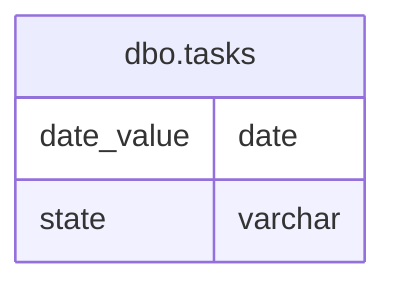

# Documentation for Table: dbo.tasks

## Overview
The `dbo.tasks` table appears to be designed for tracking tasks or events over time, with a focus on their completion status. The presence of a `date_value` column suggests that each task is associated with a specific date, while the `state` column likely indicates the outcome or status of the task (e.g., success, failure). This table could be used in various business contexts, such as project management, performance tracking, or operational reporting.

## Columns

| Name        | Type     | Nullable | Default | Description                          |
|-------------|----------|----------|---------|--------------------------------------|
| date_value  | date     | Yes      | NULL    | The date associated with the task.   |
| state       | varchar  | Yes      | NULL    | The status of the task (e.g., success). |

## Keys & Relationships
- **Primary Keys**: None defined.
- **Foreign Keys**: None defined.

## Indexes
- No indexes are defined for this table. This may impact query performance, especially for searches or filters based on `date_value` or `state`.

## Sample Data

| date_value | state   |
|------------|---------|
| 2019-01-01 | success |
| 2019-01-02 | success |
| 2019-01-03 | success |

## Data Volume
The `dbo.tasks` table currently contains approximately 6 rows. This volume is relatively small, which may not pose significant performance issues. However, as the data grows, considerations for indexing and partitioning may become necessary to maintain query performance.

## Data Quality Red Flags
- **Primary Key**: The absence of a primary key may lead to duplicate entries, making it difficult to uniquely identify records.
- **Nullable Columns**: Both columns are nullable, which could lead to incomplete records if not managed properly.
- **Lack of Indexes**: The absence of indexes may hinder performance for queries that filter or sort by `date_value` or `state`. 

Overall, while the table serves a clear purpose, enhancements in structure and indexing could improve data integrity and query performance.