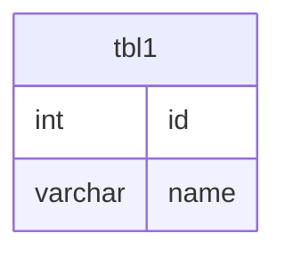

# Documentation for Table: dbo.tbl1

## Overview
The `dbo.tbl1` table appears to be designed for storing basic information about entities, likely individuals or items, given the presence of an `id` and `name` column. The `id` column is intended to serve as a unique identifier, while the `name` column holds a short string, possibly representing a person's name or a label for an item. The business purpose of this table may involve tracking or cataloging these entities within a larger system.

## Columns

| Name      | Type    | Nullable | Default | Description                       |
|-----------|---------|----------|---------|-----------------------------------|
| id        | int     | Yes      | None    | Unique identifier for the entity. |
| name      | varchar | Yes      | None    | Name or label associated with the entity. |

## Keys & Relationships
- **Primary Keys**: None defined.
- **Foreign Keys**: None defined.

## Indexes
- **No indexes defined**: This may lead to performance issues for queries that filter or sort by the `id` or `name` columns, especially as the data volume grows.

## Sample Data

| id | name  |
|----|-------|
| 1  | Ajith |
| 1  | Ajith |
| 2  | Shiv  |

## Data Volume
The table currently contains **3 rows**. This is a small volume of data, which may not pose immediate performance concerns. However, as the data grows, the lack of primary keys and indexes could lead to inefficiencies in data retrieval and integrity issues.

## Data Quality Red Flags
- **Duplicate Entries**: The sample data shows that the `id` value of `1` is duplicated, which indicates a lack of a primary key constraint. This could lead to data integrity issues.
- **Nullable Columns**: Both columns are nullable, which may lead to incomplete records if not managed properly.
- **Short Length of `name`**: The `name` column has a maximum length of 5 characters, which may be insufficient for many names or labels, potentially leading to data truncation.