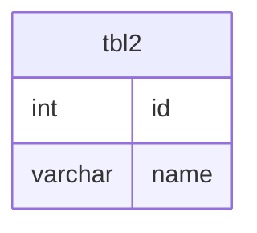

# Documentation for Table: dbo.tbl2

## Overview
The `dbo.tbl2` table appears to be a simple entity that may represent a collection of records, possibly for users or items, given the presence of an `id` and `name` column. The business purpose is likely to store basic information about these entities, although the exact context is unknown due to the lack of additional metadata.

## Columns

| Name      | Type    | Nullable | Default | Description                       |
|-----------|---------|----------|---------|-----------------------------------|
| id        | int     | Yes      | None    | Unique identifier for the record. |
| name      | varchar | Yes      | None    | Name associated with the record.  |

## Keys & Relationships
- **Primary Keys**: None defined.
- **Foreign Keys**: None defined.

## Indexes
- **No indexes defined**: This may lead to performance issues for queries that filter or sort by the `id` or `name` columns, especially as the data volume grows.

## Sample Data

| id | name  |
|----|-------|
| 1  | Ajith |

## Data Volume
The table currently contains **1 row**. This low volume suggests that it may be in the early stages of data population or that it is not a critical table in the database schema.

## Data Quality Red Flags
- **Nullable Columns**: Both columns are nullable, which may lead to incomplete records if not managed properly.
- **Lack of Primary Key**: The absence of a primary key could result in duplicate records, making data integrity a concern.
- **Short Length for `name`**: The `name` column has a maximum length of 5 characters, which may be insufficient for many use cases, leading to potential data truncation or loss of information.