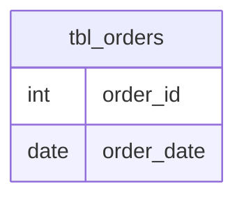

# Documentation for Table: dbo.tbl_orders

## Overview
The `dbo.tbl_orders` table is likely designed to store information about customer orders within a business context. Each record in this table represents an individual order, capturing essential details such as the unique identifier for the order and the date it was placed. This table is fundamental for tracking sales transactions and analyzing order trends over time.

## Columns

| Name        | Type | Nullable | Default | Description                       |
|-------------|------|----------|---------|-----------------------------------|
| order_id    | int  | Yes      | None    | Unique identifier for the order.  |
| order_date  | date | Yes      | None    | The date when the order was placed.|

## Keys & Relationships
- **Primary Keys**: None defined.
- **Foreign Keys**: None defined.

## Indexes
No indexes are defined for this table. Adding indexes on `order_id` or `order_date` could improve query performance, especially for searches or aggregations based on these columns.

## Sample Data

| order_id | order_date  |
|----------|-------------|
| 2        | 2022-10-22  |
| 3        | 2022-10-25  |
| 4        | 2022-10-25  |

## Data Volume
The `dbo.tbl_orders` table currently contains approximately 5 rows. This volume is relatively small, which may not pose significant performance issues. However, as the business grows and more orders are processed, careful consideration should be given to indexing and data management strategies.

## Data Quality Red Flags
- **Primary Key**: There are no defined primary keys, which could lead to duplicate entries for orders if not managed properly.
- **Nullable Columns**: Both columns are nullable, which may lead to incomplete records if not enforced at the application level.
- **Default Values**: There are no default values set for the columns, which could result in missing data if not explicitly provided during order creation.