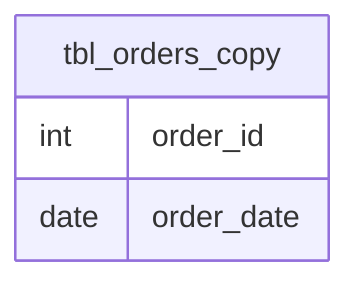

# Documentation for Table: dbo.tbl_orders_copy

## Overview
The `dbo.tbl_orders_copy` table appears to be a copy of an orders table, likely used for backup, testing, or reporting purposes. It is designed to store information about customer orders, specifically focusing on the order ID and the date the order was placed. The presence of an `order_id` suggests that this table is intended to uniquely identify each order, while the `order_date` provides temporal context for when the order occurred.

## Columns

| Name        | Type   | Nullable | Default | Description                      |
|-------------|--------|----------|---------|----------------------------------|
| order_id    | int    | Yes      | NULL    | Unique identifier for the order. |
| order_date  | date   | Yes      | NULL    | Date when the order was placed.  |

## Keys & Relationships
- **Primary Keys**: None defined.
- **Foreign Keys**: None defined.

## Indexes
No indexes are defined for this table. This may impact query performance, especially for searches or joins involving the `order_id` or `order_date` columns.

## Sample Data

| order_id | order_date  |
|----------|-------------|
| 1        | 2022-10-21  |
| 2        | 2022-10-22  |
| 3        | 2022-10-25  |

## Data Volume
The table currently contains approximately **4 rows**. This low volume suggests that it may be in the early stages of data population or is used for a limited scope of orders. The implications of this volume include potential performance benefits for queries but may also indicate that the table is not fully utilized or that data retention policies are in place.

## Data Quality Red Flags
- **Primary Key Absence**: There are no primary keys defined, which could lead to duplicate entries and data integrity issues.
- **Nullable Columns**: Both columns are nullable, which may lead to incomplete records if not managed properly.
- **Lack of Indexes**: The absence of indexes may hinder performance for queries that filter or sort based on `order_id` or `order_date`. 

Overall, while the table serves a clear purpose, there are several areas for improvement in terms of data integrity and performance optimization.