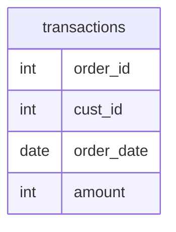

# Documentation for Table: dbo.transactions

## Overview
The `dbo.transactions` table is designed to store transaction records for a business. Each record represents a unique transaction made by a customer, capturing essential details such as the order ID, customer ID, order date, and transaction amount. This table likely serves as a foundational component for analyzing sales performance, customer purchasing behavior, and financial reporting.

## Columns

| Name        | Type  | Nullable | Default | Description                          |
|-------------|-------|----------|---------|--------------------------------------|
| order_id    | int   | Yes      | None    | Unique identifier for each order.   |
| cust_id     | int   | Yes      | None    | Identifier for the customer making the order. |
| order_date  | date  | Yes      | None    | Date when the order was placed.     |
| amount      | int   | Yes      | None    | Total amount for the transaction.    |

## Keys & Relationships
- **Primary Keys**: None defined.
- **Foreign Keys**: None defined.

## Indexes
- **No indexes defined**: This may impact query performance, especially for searches or joins involving the `order_id` or `cust_id` columns.

## Sample Data

| order_id | cust_id | order_date | amount |
|----------|---------|------------|--------|
| 1        | 1       | 2020-01-15 | 150    |
| 2        | 1       | 2020-02-10 | 150    |
| 3        | 2       | 2020-01-16 | 150    |

## Data Volume
The `dbo.transactions` table currently contains approximately **8 rows**. This volume is relatively small, which may not pose significant performance issues but could limit the insights derived from analysis. As the business grows, monitoring the growth of this table will be essential for maintaining performance.

## Data Quality Red Flags
- **Nullable Columns**: All columns are nullable, which may lead to incomplete records if not managed properly.
- **No Primary Key**: The absence of a primary key could lead to duplicate records, making data integrity a concern.
- **Lack of Foreign Keys**: Without foreign keys, there is no enforced relationship with other tables, which may lead to orphaned records or inconsistencies in customer data.

Overall, while the `dbo.transactions` table serves a critical function, attention should be given to its structure and data integrity to ensure reliable reporting and analysis.