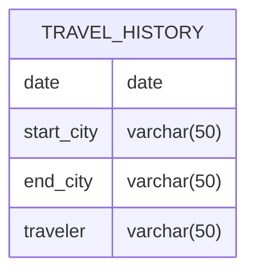

# Documentation for Table: dbo.travel_history

## Overview
The `dbo.travel_history` table is designed to store records of travel itineraries for individuals. Each record captures details about a specific journey, including the date of travel, the starting city, the destination city, and the traveler's name. This table likely serves the purpose of tracking travel patterns, analyzing travel behavior, or managing travel-related services for customers.

## Columns

| Name        | Type      | Nullable | Default | Description                       |
|-------------|-----------|----------|---------|-----------------------------------|
| date        | date      | Yes      | None    | The date of the travel            |
| start_city  | varchar(50) | Yes    | None    | The city from which the travel starts |
| end_city    | varchar(50) | Yes    | None    | The city where the travel ends    |
| traveler     | varchar(50) | Yes    | None    | The name of the traveler          |

## Keys & Relationships
- **Primary Keys**: None defined for this table.
- **Foreign Keys**: None defined for this table.

## Indexes
- **No indexes defined**: This may affect query performance, especially for searches based on `start_city`, `end_city`, or `traveler`. Adding indexes on these columns could improve lookup times for travel records.

## Sample Data

| date       | start_city | end_city | traveler |
|------------|------------|----------|----------|
| 2024-01-01 | Delhi      | Dubai    | Amit     |
| 2024-01-05 | Dubai      | London   | Amit     |
| 2024-01-10 | London     | Delhi    | Amit     |

## Data Volume
The `travel_history` table currently contains approximately **15 rows**. This volume suggests that the table is in the early stages of data accumulation. As more travel records are added, considerations for indexing and data management will become increasingly important to maintain performance.

## Data Quality Red Flags
- **Nullable Columns**: All columns in the table are nullable, which may lead to incomplete records if not managed properly.
- **Lack of Primary Key**: The absence of a primary key could result in duplicate entries, making it difficult to uniquely identify travel records.
- **No Foreign Keys**: Without foreign key constraints, there is no enforcement of relationships with other tables, which could lead to data integrity issues.
- **Sample Data Consistency**: The sample data shows consistent traveler names, but it is unclear if this pattern holds across the entire dataset. Further analysis is needed to ensure data consistency and integrity.