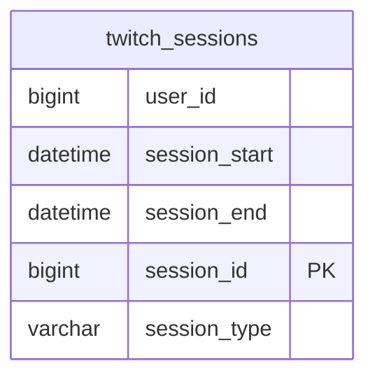

# Documentation for `dbo.twitch_sessions` Table

## Overview
The `twitch_sessions` table is designed to store session data related to users on the Twitch platform. Each record represents a unique session, capturing details such as the user involved, the start and end times of the session, and the type of session (e.g., viewer or streamer). This table is likely used for analytics purposes, enabling the analysis of user engagement and behavior on the platform.

## Columns

| Name            | Type      | Nullable | Default | Description                                   |
|-----------------|-----------|----------|---------|-----------------------------------------------|
| user_id         | bigint    | Yes      | NULL    | Identifier for the user associated with the session. |
| session_start   | datetime  | Yes      | NULL    | The date and time when the session started.  |
| session_end     | datetime  | Yes      | NULL    | The date and time when the session ended.    |
| session_id (PK) | bigint    | No       | NULL    | Unique identifier for the session.            |
| session_type    | varchar(20)| Yes     | NULL    | Type of session (e.g., viewer, streamer).    |

## Keys & Relationships
- **Primary Key**: 
  - `session_id`
  
- **Foreign Keys**: 
  - None

## Indexes
- **PK__twitch_s__69B13FDCA8AB875D**: 
  - Columns: `session_id`
  - Type: Clustered
  - Usage: This index ensures that each session_id is unique and supports efficient retrieval of session records by their unique identifier.

## Sample Data

| user_id | session_start         | session_end           | session_id | session_type |
|---------|-----------------------|-----------------------|------------|---------------|
| 101     | 2024-02-01 10:00:00   | 2024-02-01 11:00:00   | 1          | viewer        |
| 101     | 2024-02-02 14:00:00   | 2024-02-02 15:30:00   | 2          | streamer      |
| 102     | 2024-02-01 09:30:00   | 2024-02-01 10:30:00   | 3          | viewer        |

## Data Volume
The `twitch_sessions` table currently contains approximately **10 rows**. This volume suggests that the table may be in the early stages of data accumulation or may be used for a specific subset of users or sessions.

## Data Quality Red Flags
- The `user_id`, `session_start`, and `session_end` columns are nullable, which may lead to incomplete records if not properly managed.
- There are no foreign keys defined, which could lead to orphaned records if user data is stored in a separate table.
- The `session_type` column is also nullable, which may result in sessions being recorded without a defined type, potentially complicating analysis.