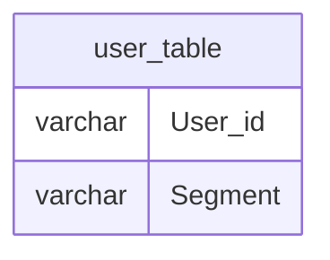

# Documentation for `dbo.user_table`

## Overview
The `user_table` is designed to store user-related data, specifically focusing on user identifiers and their associated segments. The inferred business purpose of this table is to categorize users into different segments, which could be used for targeted marketing, user analysis, or reporting purposes. The table appears to be foundational for understanding user demographics or behaviors based on their segment classification.

## Columns

| Name       | Type    | Nullable | Default | Description                          |
|------------|---------|----------|---------|--------------------------------------|
| User_id   | varchar | No       | None    | Unique identifier for each user.    |
| Segment    | varchar | No       | None    | Segment classification for the user. |

## Keys & Relationships
- **Primary Keys**: None defined.
- **Foreign Keys**: None defined.

## Indexes
- **Indexes**: None defined. 
  - This suggests that queries may not be optimized for performance, especially if the table grows in size. Consider adding indexes on `User_id` or `Segment` for faster lookups.

## Sample Data

| User_id | Segment |
|---------|---------|
| u1      | s1      |
| u2      | s1      |
| u3      | s1      |

## Data Volume
The `user_table` currently contains approximately **10 rows**. This volume is relatively small, which may not pose significant performance issues. However, as the user base grows, careful consideration should be given to indexing and potential partitioning strategies to maintain query performance.

## Data Quality Red Flags
- **Primary Key Absence**: The absence of a primary key raises concerns about data integrity and uniqueness of records. It is advisable to define a primary key to ensure that each user is uniquely identifiable.
- **Column Lengths**: The `User_id` and `Segment` columns have relatively short maximum lengths (3 and 2 characters, respectively). This may limit the ability to store meaningful identifiers or segment classifications.
- **Nullable Columns**: Both columns are defined as non-nullable, which is good for data integrity, but it also means that any data entry errors could lead to issues if not handled properly.

Overall, while the table serves a clear purpose, improvements in structure and indexing are recommended for better data management and performance as the dataset grows.