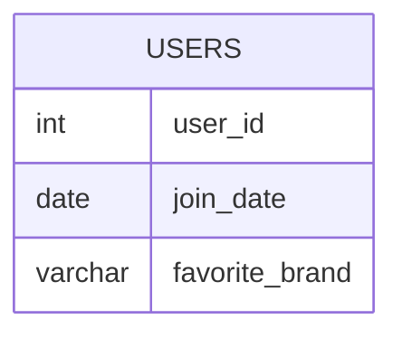

# Documentation for Table: dbo.users

## Overview
The `dbo.users` table is designed to store information about users within a system. The inferred business purpose of this table is to maintain a record of users, including their unique identifiers, the date they joined, and their preferred brand. This information could be utilized for user management, marketing analysis, and customer relationship management.

## Columns

| Name              | Type         | Nullable | Default | Description                          |
|-------------------|--------------|----------|---------|--------------------------------------|
| user_id           | int          | Yes      | None    | Unique identifier for each user (PK)|
| join_date         | date         | Yes      | None    | The date the user joined the system  |
| favorite_brand     | varchar(50)  | Yes      | None    | The user's preferred brand           |

## Keys & Relationships
- **Primary Keys**: None defined.
- **Foreign Keys**: None defined.

## Indexes
- **No indexes defined**: This may impact query performance, especially for searches or joins involving the `user_id` or `join_date` columns.

## Sample Data

| user_id | join_date  | favorite_brand |
|---------|------------|----------------|
| 1       | 2019-01-01 | Lenovo         |
| 2       | 2019-02-09 | Samsung        |
| 3       | 2019-01-19 | LG             |

## Data Volume
The `dbo.users` table currently contains approximately **4 rows**. This low volume suggests that the table may be in the early stages of data population or that it is used for a specific subset of users. As the user base grows, considerations for indexing and performance optimization may become necessary.

## Data Quality Red Flags
- **Primary Key Absence**: The absence of a primary key could lead to duplicate entries and data integrity issues.
- **Nullable Columns**: All columns are nullable, which may lead to incomplete records if not managed properly.
- **Default Values**: No default values are set, which could result in missing data if not explicitly provided during inserts. 

Overall, while the table serves a clear purpose, the lack of constraints and indexes may pose risks to data integrity and performance as the dataset grows.